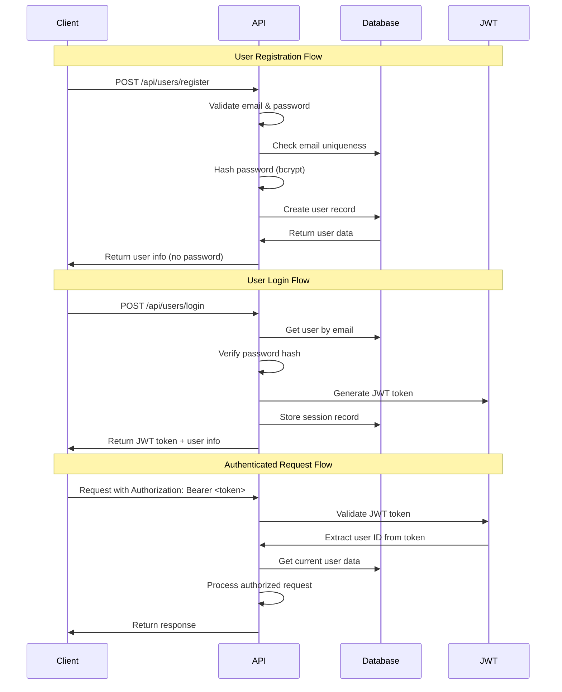

# Photo Share Service - Architecture Documentation

**Version**: 2.3.0-monitoring  
**Date**: 2025-08-18  
**Service**: Single FastAPI Photo Sharing Application  

---

## 🏗️ Architecture Overview

The Photo Share Service follows a **single-service architecture** built with FastAPI and PostgreSQL, designed for production-ready deployment with comprehensive security, performance optimization, and monitoring capabilities.

### Design Principles

1. **Simplicity**: Single FastAPI service eliminates complexity of microservices
2. **Security First**: JWT authentication, input validation, rate limiting
3. **Performance**: Memory caching, query optimization, async operations
4. **Monitoring**: Comprehensive metrics and health checks
5. **Maintainability**: Clean modular code with comprehensive testing

---

## 📁 Code Architecture

### Core Service Structure

```
services/photoshare/
├── main_database.py          # 🚀 FastAPI Application Entry Point
├── database.py              # 🗄️  PostgreSQL Models & Repositories
├── security.py              # 🛡️  Security Framework & Middleware
├── monitoring.py            # 📊 Prometheus Metrics & Health Checks
├── performance_simple.py    # ⚡ Caching & Query Optimization
├── error_handling.py        # 🚨 Error Management & Logging
├── file_storage.py          # 📁 File Operations & Storage
├── service_discovery.py     # 🔍 Service Registry Integration
├── Dockerfile.database      # 🐳 Container Configuration
├── requirements_fixed.txt   # 📦 Production Dependencies
├── requirements_test.txt    # 🧪 Test Dependencies
├── run_tests.py            # 🎯 Test Runner Script
├── pytest.ini             # ⚙️  Test Configuration
└── tests/                  # 🧪 Comprehensive Test Suite
    ├── conftest.py         # Test fixtures and configuration
    ├── unit/              # Unit tests (4 files)
    ├── integration/       # Integration tests (2 files)
    └── security/          # Security tests (4 files)
```

### Module Responsibilities

#### 🚀 **main_database.py** - Application Core
- **Purpose**: FastAPI application entry point and route definitions
- **Key Features**:
  - FastAPI app initialization and middleware setup
  - User management endpoints (register, login, profile)
  - Photo management endpoints (upload, download, listing)
  - Platform monitoring endpoints (stats, health, metrics)
  - JWT authentication and authorization
  - Request validation and error handling
  - Service startup and shutdown management

#### 🗄️ **database.py** - Data Layer
- **Purpose**: PostgreSQL integration with async SQLAlchemy
- **Key Components**:
  - SQLAlchemy models (User, Photo, Session)
  - Repository pattern for data access
  - Database connection management
  - Query optimization and indexing
  - Transaction handling
  - Database health checks

#### 🛡️ **security.py** - Security Framework
- **Purpose**: Comprehensive security implementation
- **Security Features**:
  - Rate limiting middleware
  - Input validation and sanitization
  - JWT token management and validation
  - File upload security scanning
  - Security audit logging
  - CORS configuration
  - Request validation middleware

#### 📊 **monitoring.py** - Observability
- **Purpose**: Metrics collection and health monitoring
- **Monitoring Capabilities**:
  - Prometheus metrics export
  - Request/response metrics
  - Database performance metrics
  - Cache analytics
  - Error tracking and alerting
  - Health check endpoints

#### ⚡ **performance_simple.py** - Performance Optimization
- **Purpose**: Application performance and caching
- **Performance Features**:
  - Memory-based caching system
  - Query result caching
  - Cache analytics and hit rates
  - Performance benchmarking
  - Query optimization recommendations
  - Cache warming strategies

#### 🚨 **error_handling.py** - Error Management
- **Purpose**: Centralized error handling and logging
- **Error Handling Features**:
  - Structured error responses
  - Error categorization and logging
  - Performance monitoring integration
  - Database error handling
  - Authentication error handling
  - File storage error handling

#### 📁 **file_storage.py** - File Management
- **Purpose**: File operations and storage management
- **Storage Features**:
  - Local file storage with organization
  - File upload validation and processing
  - Storage health checks
  - File retrieval and streaming
  - Platform storage integration support
  - File cleanup and management

#### 🔍 **service_discovery.py** - Service Integration
- **Purpose**: Service registry and discovery
- **Integration Features**:
  - Service registration and discovery
  - Health check coordination
  - External service integration
  - Service status monitoring
  - Registry management

---

## 🗄️ Database Schema

### Entity Relationship Diagram

```
┌─────────────────┐       ┌─────────────────┐       ┌─────────────────┐
│     USERS       │       │     PHOTOS      │       │    SESSIONS     │
├─────────────────┤       ├─────────────────┤       ├─────────────────┤
│ id (PK)         │───┐   │ id (PK)         │   ┌───│ id (PK)         │
│ email (UNIQUE)  │   └──▶│ user_id (FK)    │   │   │ user_id (FK)    │
│ password_hash   │       │ filename        │   │   │ token (UNIQUE)  │
│ created_at      │       │ original_filename│   │   │ created_at      │
│ updated_at      │       │ content_type    │   │   │ expires_at      │
│ is_verified     │       │ file_size       │   │   │ is_active       │
│ is_active       │       │ storage_path    │   │   └─────────────────┘
└─────────────────┘       │ title           │   │
                          │ description     │   │
                          │ is_public       │   │
                          │ created_at      │   │
                          │ updated_at      │   │
                          └─────────────────┘   │
                                   │            │
                                   └────────────┘
```

### Database Tables

#### Users Table
```sql
CREATE TABLE users (
    id SERIAL PRIMARY KEY,
    email VARCHAR(255) UNIQUE NOT NULL,
    password_hash VARCHAR(255) NOT NULL,
    created_at TIMESTAMP WITH TIME ZONE DEFAULT NOW(),
    updated_at TIMESTAMP WITH TIME ZONE DEFAULT NOW(),
    is_verified BOOLEAN DEFAULT FALSE,
    is_active BOOLEAN DEFAULT TRUE,
    
    -- Indexes
    INDEX idx_users_email (email),
    INDEX idx_users_active (is_active)
);
```

#### Photos Table
```sql
CREATE TABLE photos (
    id SERIAL PRIMARY KEY,
    user_id INTEGER NOT NULL REFERENCES users(id) ON DELETE CASCADE,
    filename VARCHAR(255) NOT NULL,
    original_filename VARCHAR(255) NOT NULL,
    content_type VARCHAR(100) NOT NULL,
    file_size INTEGER NOT NULL,
    storage_path VARCHAR(500) NOT NULL,
    title VARCHAR(255),
    description TEXT,
    is_public BOOLEAN DEFAULT FALSE,
    created_at TIMESTAMP WITH TIME ZONE DEFAULT NOW(),
    updated_at TIMESTAMP WITH TIME ZONE DEFAULT NOW(),
    
    -- Indexes
    INDEX idx_photos_user_id (user_id),
    INDEX idx_photos_public (is_public),
    INDEX idx_photos_created (created_at DESC),
    INDEX idx_photos_user_public (user_id, is_public)
);
```

#### Sessions Table
```sql
CREATE TABLE sessions (
    id SERIAL PRIMARY KEY,
    user_id INTEGER NOT NULL REFERENCES users(id) ON DELETE CASCADE,
    token VARCHAR(255) UNIQUE NOT NULL,
    created_at TIMESTAMP WITH TIME ZONE DEFAULT NOW(),
    expires_at TIMESTAMP WITH TIME ZONE,
    is_active BOOLEAN DEFAULT TRUE,
    
    -- Indexes
    INDEX idx_sessions_token (token),
    INDEX idx_sessions_user_id (user_id),
    INDEX idx_sessions_active (is_active),
    INDEX idx_sessions_expires (expires_at)
);
```

### Database Optimization Features

- **Connection Pooling**: AsyncPG with connection pooling for optimal performance
- **Query Optimization**: Strategic indexing and optimized queries
- **Transaction Management**: Proper transaction boundaries for data integrity
- **Caching Layer**: Query result caching to reduce database load
- **Health Monitoring**: Database connectivity and performance monitoring

---

## 🔐 Authentication & Authorization Flow

### JWT Authentication Flow



### Authentication Components

#### 1. **Password Security**
```python
# Password hashing with bcrypt
pwd_context = CryptContext(schemes=["bcrypt"], deprecated="auto")

# Strong password validation
- Minimum 8 characters
- Must contain uppercase, lowercase, numbers
- Special characters recommended
```

#### 2. **JWT Token Management**
```python
# JWT Configuration
ALGORITHM = "HS256"
ACCESS_TOKEN_EXPIRE_MINUTES = 30

# Token payload structure
{
    "sub": str(user_id),
    "email": user_email,
    "iat": issued_at_timestamp,
    "exp": expiration_timestamp
}
```

#### 3. **Session Tracking**
- All login sessions stored in database
- Token validation with revocation support
- Session expiration management
- Active session monitoring

#### 4. **Security Middleware**
- Rate limiting per IP and user
- Request validation and sanitization
- CORS protection
- Security headers enforcement

---

## ⚡ Performance Architecture

### Caching Strategy

```
┌─────────────────┐    ┌─────────────────┐    ┌─────────────────┐
│   Client        │    │  FastAPI App    │    │   PostgreSQL    │
│   Request       │───▶│                 │───▶│   Database      │
└─────────────────┘    │  ┌───────────┐  │    └─────────────────┘
                       │  │  Memory   │  │             ▲
                       │  │  Cache    │  │             │
                       │  │  Layer    │  │    ┌─────────────────┐
                       │  └───────────┘  │    │     Redis       │
                       │                 │    │  (Future/Optional)
                       └─────────────────┘    └─────────────────┘
```

### Performance Features

#### 1. **Memory Caching**
- Query result caching for frequently accessed data
- User photos caching with TTL
- Public photos caching
- Platform statistics caching
- Cache analytics and hit rate monitoring

#### 2. **Query Optimization**
- Strategic database indexing
- Optimized SQL queries with SQLAlchemy
- Connection pooling for database efficiency
- Lazy loading for related data

#### 3. **Async Operations**
- Full async/await pattern implementation
- Non-blocking database operations
- Concurrent request handling
- Async file operations

#### 4. **Performance Monitoring**
- Request latency tracking
- Database query performance metrics
- Cache hit rates and efficiency
- Memory usage monitoring

---

## 📊 Monitoring & Observability

### Metrics Architecture

```
┌─────────────────┐    ┌─────────────────┐    ┌─────────────────┐
│  FastAPI App    │    │   Prometheus    │    │    Grafana      │
│                 │───▶│    Metrics      │───▶│   Dashboard     │
│ Custom Metrics  │    │   Collection    │    │ Visualization   │
└─────────────────┘    └─────────────────┘    └─────────────────┘
         │
         ▼
┌─────────────────┐
│   Application   │
│   Logs          │
└─────────────────┘
```

### Monitoring Components

#### 1. **Health Checks**
- Basic health endpoint (`/health`)
- Detailed health with authentication (`/health/detailed`)
- Database connectivity monitoring
- File storage health verification

#### 2. **Prometheus Metrics** (`/metrics`)
- HTTP request metrics (duration, count, status codes)
- Database operation metrics
- Cache performance metrics
- Authentication metrics
- Error tracking metrics

#### 3. **Platform Monitoring**
- Service statistics (`/api/platform/stats`)
- Performance analytics (`/api/platform/performance`)
- Security monitoring (`/api/platform/security`)
- Error analysis (`/api/platform/errors`)

#### 4. **Real-time Analytics**
- Request/response tracking
- User activity monitoring
- Photo upload/download statistics
- Cache analytics and optimization recommendations

---

## 🧪 Testing Architecture

### Test Structure Overview

```
tests/
├── conftest.py              # 🏗️ Test Configuration & Fixtures
├── unit/                    # 🔬 Unit Tests (4 files)
│   ├── test_basic.py        # Basic setup and imports
│   ├── test_database.py     # Database models and repositories
│   ├── test_performance.py  # Performance components
│   └── test_security.py     # Security components
├── integration/             # 🔗 Integration Tests (2 files)
│   ├── test_api_auth.py     # Authentication API endpoints
│   └── test_api_photos.py   # Photo management API endpoints
└── security/                # 🛡️ Security Tests (4 files)
    ├── test_owasp_compliance.py    # OWASP Top 10 compliance
    ├── test_penetration_testing.py # Penetration testing
    ├── test_gdpr_compliance.py     # GDPR compliance
    └── test_fuzz_testing.py        # Fuzz testing
```

### Test Categories Explained

#### 🔬 **Unit Tests**
- **Scope**: Individual components and functions
- **Purpose**: Verify core functionality in isolation
- **Coverage**: Database models, security functions, caching, error handling
- **Execution**: Fast (< 1 second per test)
- **Dependencies**: Mocked external services

#### 🔗 **Integration Tests**
- **Scope**: API endpoints and service integration
- **Purpose**: Verify complete request/response cycles
- **Coverage**: Authentication flow, photo management, API contracts
- **Execution**: Medium speed (1-5 seconds per test)
- **Dependencies**: Test database, mocked file storage

#### 🛡️ **Security Tests**
- **Scope**: Security controls and compliance
- **Purpose**: Verify security measures and regulatory compliance
- **Coverage**: OWASP Top 10, GDPR, penetration testing, fuzz testing
- **Execution**: Slow (5+ seconds per test)
- **Dependencies**: Full application stack

### Test Execution Framework

#### **Test Runner** (`run_tests.py`)
```bash
# Run all tests with coverage
python3 run_tests.py all --verbose

# Run specific test categories
python3 run_tests.py unit          # Fast unit tests
python3 run_tests.py integration   # API integration tests  
python3 run_tests.py security      # Comprehensive security tests
python3 run_tests.py performance   # Performance benchmarks

# Install dependencies and run tests
python3 run_tests.py all --install-deps --verbose
```

#### **Test Configuration** (`pytest.ini`)
- Async test mode enabled
- Coverage reporting (80% minimum)
- HTML and XML coverage reports
- Strict marker and configuration enforcement
- Multiple output formats (terminal, HTML, XML)

#### **Test Fixtures** (`conftest.py`)
- Database session management with in-memory SQLite
- User and photo test data factories
- Authentication header generation
- Mock file storage services
- Test client configuration

### Test Plan Integration

The comprehensive [TEST_PLAN.md](TEST_PLAN.md) provides:

1. **Quick Validation Tests** (5-10 minutes)
   - Health checks and API availability
   - Authentication flow validation
   - Photo upload/download functionality

2. **Manual API Testing**
   - Complete user registration, email verification, and login flow
   - Photo management operations
   - Security validation tests
   - Performance benchmarking

3. **Automated Test Suite**
   - Unit, integration, and security test execution
   - Coverage reporting and analysis
   - Performance benchmarking
   - Continuous integration support

---

## 🚀 Deployment Architecture

### Container Architecture

```dockerfile
# Multi-stage Docker build
FROM python:3.11-slim as base
# Dependency installation
FROM base as dependencies
# Application layer
FROM dependencies as application
```

### Service Orchestration (Docker Compose)

```yaml
services:
  photo-share-platform:     # Main FastAPI application
    build: services/photoshare
    ports: ["8080:8000"]
    depends_on: [platform-db, platform-cache]
    
  platform-db:              # PostgreSQL database
    image: postgres:15-alpine
    ports: ["5432:5432"]
    
  platform-cache:           # Redis cache (optional)
    image: redis:7-alpine
    ports: ["6379:6379"]
    
  platform-prometheus:      # Metrics collection
    image: prom/prometheus
    ports: ["9090:9090"]
    
  platform-grafana:         # Metrics visualization
    image: grafana/grafana
    ports: ["3000:3000"]
```

### Production Deployment Considerations

1. **Security**
   - SSL/TLS termination
   - Secure JWT secret management
   - Environment variable security
   - Database connection security

2. **Scalability**
   - Horizontal scaling support
   - Database connection pooling
   - Load balancer configuration
   - Cache optimization

3. **Monitoring**
   - Log aggregation
   - Metrics collection
   - Alert configuration
   - Health check monitoring

4. **Backup & Recovery**
   - Database backup strategy
   - File storage backup
   - Disaster recovery procedures
   - Data retention policies

---

## 🔗 Integration Points

### External Service Integration

1. **File Storage Integration**
   - Local file storage (primary)
   - Cloud storage adapters (AWS S3, Google Cloud, Azure)
   - Storage health monitoring
   - File migration support

2. **Monitoring Integration**
   - Prometheus metrics export
   - Grafana dashboard integration
   - Alert manager compatibility
   - Log aggregation (ELK stack, Splunk)

3. **Authentication Integration**
   - OAuth2/OIDC support (future)
   - LDAP integration (future)
   - Multi-factor authentication (future)
   - Session management integration

4. **API Integration**
   - RESTful API with OpenAPI/Swagger
   - JSON response format
   - Standard HTTP status codes
   - CORS support for web clients

---

## 📋 Development Workflow

### Code Quality Standards

1. **Code Style**
   - Python PEP 8 compliance
   - Type hints for function signatures
   - Async/await patterns for I/O operations
   - Comprehensive docstrings

2. **Security Standards**
   - Input validation for all endpoints
   - SQL injection prevention
   - XSS protection
   - CSRF protection

3. **Performance Standards**
   - Response times < 200ms for simple operations
   - Database query optimization
   - Efficient caching strategies
   - Memory usage optimization

4. **Testing Standards**
   - 80% minimum code coverage
   - All API endpoints tested
   - Security controls validated
   - Performance benchmarks maintained

### Development Process

1. **Setup**: Follow README.md quick start guide
2. **Development**: Implement features with comprehensive testing
3. **Testing**: Run full test suite before commits
4. **Documentation**: Update architecture docs for significant changes
5. **Deployment**: Use docker-compose for consistent environments

---

## 🔄 Migration and Evolution

### Future Architecture Considerations

1. **Microservices Migration Path**
   - Service boundary identification
   - Data migration strategies
   - API gateway integration
   - Inter-service communication

2. **Scalability Enhancements**
   - Database sharding strategies
   - Caching layer improvements
   - CDN integration for file serving
   - Load balancing optimization

3. **Security Enhancements**
   - Advanced authentication methods
   - Enhanced audit logging
   - Compliance framework integration
   - Security scanning automation

4. **Monitoring Evolution**
   - Advanced analytics integration
   - Machine learning for anomaly detection
   - Custom dashboard development
   - Real-time alerting improvements

---

This architecture document provides a comprehensive overview of the Photo Share Service design, implementation, and operational considerations. The single-service architecture prioritizes simplicity while maintaining production-ready capabilities for security, performance, and monitoring.

For implementation details, refer to the individual module documentation and the comprehensive test plan in [TEST_PLAN.md](TEST_PLAN.md).