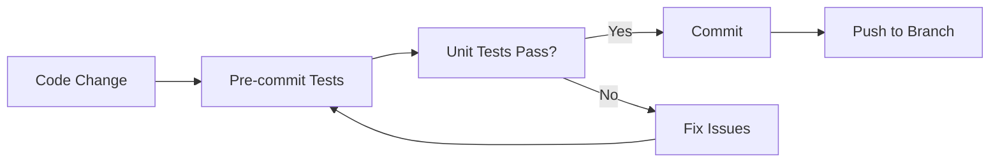

# Comprehensive Test Plan - Photo Share Social Media Platform

**Project**: Photo Share Consul Service  
**Version**: 2.3.0-monitoring (Enhanced)  
**Date**: August 21, 2025  
**Test Framework**: pytest, FastAPI TestClient, Docker  
**Coverage Goal**: >95% code coverage  

---

## 📋 **Test Overview**

This comprehensive test plan validates the complete social media platform functionality including all Phase 1, Phase 2, and Phase 3 features implemented through our development journey.

### **Test Categories:**
1. **Unit Tests** - Individual component testing
2. **Integration Tests** - API endpoint and workflow testing  
3. **Security Tests** - OWASP, GDPR compliance, penetration testing
4. **Performance Tests** - Load testing, caching, monitoring
5. **End-to-End Tests** - Complete user journey validation
6. **Feature Tests** - Social media features validation

---

## 🏗️ **Test Directory Structure**

```
tests/
├── README.md                          # Test execution guide
├── conftest.py                        # Global test configuration
├── pytest.ini                        # Pytest configuration
├── requirements.txt                   # Test dependencies
├── test_data/                         # Test fixtures and data
│   ├── images/                        # Sample images for testing
│   ├── fixtures.json                  # JSON test data
│   └── sample_users.json              # User test data
├── unit/                              # Unit tests
│   ├── test_database.py               # Database operations
│   ├── test_security.py               # Security components
│   ├── test_performance.py            # Performance optimization
│   ├── test_image_processing.py       # Image processing pipeline
│   ├── test_logging_middleware.py     # Logging and correlation
│   └── test_basic.py                  # Basic service functionality
├── integration/                       # Integration tests
│   ├── test_api_auth.py               # Authentication workflows
│   ├── test_api_photos.py             # Photo management
│   ├── test_api_social.py             # Social features
│   ├── test_api_albums.py             # Album management
│   ├── test_api_profiles.py           # User profiles
│   ├── test_api_notifications.py      # Notification system
│   ├── test_api_sharing.py            # Photo sharing
│   ├── test_api_search.py             # Search and tagging
│   └── test_production_readiness.py   # Production features
├── security/                          # Security tests
│   ├── test_owasp_compliance.py       # OWASP Top 10
│   ├── test_gdpr_compliance.py        # GDPR compliance
│   ├── test_fuzz_testing.py           # Fuzzing tests
│   ├── test_penetration_testing.py    # Penetration tests
│   └── test_file_security.py          # File upload security
├── performance/                       # Performance tests
│   ├── test_load_testing.py           # Load and stress tests
│   ├── test_caching.py                # Cache performance
│   ├── test_database_performance.py   # DB query optimization
│   └── test_monitoring.py             # Monitoring systems
├── e2e/                              # End-to-end tests
│   ├── test_user_registration.py      # Complete user onboarding
│   ├── test_photo_lifecycle.py        # Photo upload to sharing
│   ├── test_social_interactions.py    # Social media workflows
│   └── test_admin_workflows.py        # Admin functionality
├── api/                              # API test scripts
│   ├── test_auth_flow.py              # Authentication API tests
│   ├── test_photo_upload.py           # Photo upload API tests
│   ├── test_email_verification.py     # Email verification tests
│   ├── test_social_features.py        # Social API tests
│   ├── test_album_management.py       # Album API tests
│   ├── test_profile_management.py     # Profile API tests
│   ├── test_notification_system.py    # Notification API tests
│   └── test_sharing_system.py         # Sharing API tests
└── scripts/                          # Test automation scripts
    ├── run_all_tests.py               # Master test runner
    ├── run_unit_tests.py              # Unit test runner
    ├── run_integration_tests.py       # Integration test runner
    ├── run_security_tests.py          # Security test runner
    ├── run_performance_tests.py       # Performance test runner
    ├── generate_test_report.py        # Test reporting
    └── setup_test_environment.py      # Test environment setup
```

---

## 🎯 **Test Coverage Targets**

### **Feature Coverage Matrix:**

| Feature Category | Test Types | Coverage Target | Priority |
|------------------|------------|-----------------|----------|
| **Core Authentication** | Unit, Integration, Security | 100% | Critical |
| **Email Verification** | Unit, Integration, E2E | 100% | Critical |
| **Photo Upload & Processing** | Unit, Integration, Performance | 95% | Critical |
| **Image Processing Pipeline** | Unit, Integration | 90% | High |
| **Social Features** | Integration, E2E | 90% | High |
| **Album Management** | Unit, Integration | 85% | High |
| **User Profiles** | Integration, E2E | 85% | Medium |
| **Notification System** | Unit, Integration | 80% | Medium |
| **Photo Sharing** | Integration, Security | 90% | High |
| **Search & Tagging** | Integration, Performance | 80% | Medium |
| **Monitoring & Logging** | Unit, Integration | 75% | Medium |
| **Security Framework** | Security, Penetration | 100% | Critical |

---

## 🧪 **Detailed Test Specifications**

### **1. Unit Tests**

#### **1.1 Database Tests (`test_database.py`)**
```python
class TestDatabaseOperations:
    - test_user_creation_and_retrieval()
    - test_photo_metadata_storage()
    - test_foreign_key_constraints()
    - test_connection_pooling()
    - test_transaction_rollback()
    - test_database_migrations()
    - test_enhanced_models_creation()
    - test_cascade_deletions()
```

#### **1.2 Security Tests (`test_security.py`)**
```python
class TestSecurityComponents:
    - test_jwt_token_generation()
    - test_password_hashing()
    - test_rate_limiting()
    - test_input_validation()
    - test_file_upload_security()
    - test_correlation_id_generation()
    - test_request_logging_sanitization()
```

#### **1.3 Image Processing Tests (`test_image_processing.py`)**
```python
class TestImageProcessing:
    - test_image_validation()
    - test_exif_data_extraction()
    - test_image_optimization()
    - test_thumbnail_generation()
    - test_perceptual_hashing()
    - test_watermark_application()
    - test_malicious_file_detection()
```

### **2. Integration Tests**

#### **2.1 Social Features Tests (`test_api_social.py`)**
```python
class TestSocialFeatures:
    - test_photo_like_unlike_workflow()
    - test_comment_creation_and_replies()
    - test_user_follow_unfollow()
    - test_photo_tagging_system()
    - test_popular_tags_endpoint()
    - test_social_permissions()
```

#### **2.2 Album Management Tests (`test_api_albums.py`)**
```python
class TestAlbumManagement:
    - test_album_creation()
    - test_photo_addition_to_album()
    - test_album_photo_ordering()
    - test_album_privacy_settings()
    - test_album_cover_photo()
    - test_album_deletion_cascade()
```

#### **2.3 Notification System Tests (`test_api_notifications.py`)**
```python
class TestNotificationSystem:
    - test_notification_creation()
    - test_notification_reading()
    - test_bulk_notification_operations()
    - test_notification_filtering()
    - test_unread_count_tracking()
    - test_notification_permissions()
```

### **3. Security Tests**

#### **3.1 File Security Tests (`test_file_security.py`)**
```python
class TestFileSecurityEnhancements:
    - test_image_only_validation()
    - test_magic_number_verification()
    - test_malicious_file_rejection()
    - test_file_size_limits()
    - test_mime_type_validation()
    - test_exif_data_sanitization()
```

### **4. Performance Tests**

#### **4.1 Load Testing (`test_load_testing.py`)**
```python
class TestLoadPerformance:
    - test_concurrent_user_registration()
    - test_bulk_photo_uploads()
    - test_high_volume_social_interactions()
    - test_database_connection_limits()
    - test_cache_performance_under_load()
```

### **5. End-to-End Tests**

#### **5.1 Complete User Journey (`test_social_interactions.py`)**
```python
class TestSocialMediaWorkflow:
    - test_complete_user_onboarding()
    - test_photo_upload_to_sharing_journey()
    - test_social_interaction_workflow()
    - test_album_creation_and_management()
    - test_notification_delivery_workflow()
```

---

## 📊 **Test Execution Strategy**

### **1. Pre-commit Testing (Fast Feedback)**
```bash
# Run critical tests before commits (~2 minutes)
pytest tests/unit/ -v --tb=short
pytest tests/integration/test_api_auth.py -v
pytest tests/security/test_file_security.py -v
```

### **2. CI/CD Pipeline Testing (Comprehensive)**
```bash
# Full test suite for pull requests (~15 minutes)
pytest tests/ --cov=services/photoshare --cov-report=html
pytest tests/security/ --tb=short
pytest tests/performance/ --tb=short
```

### **3. Nightly Testing (Full Validation)**
```bash
# Complete test suite including load tests (~45 minutes)
pytest tests/ --cov=services/photoshare --cov-report=html --cov-fail-under=90
pytest tests/e2e/ -v
pytest tests/performance/ --load-test
```

---

## 🔧 **Test Environment Setup**

### **1. Test Database Configuration**
```yaml
# docker-compose.test.yml
services:
  test-db:
    image: postgres:15
    environment:
      POSTGRES_DB: photo_share_test
      POSTGRES_USER: test_user
      POSTGRES_PASSWORD: test_pass
    ports:
      - "5433:5432"
```

### **2. Test Data Management**
```python
# Test fixtures and sample data
@pytest.fixture
def sample_users():
    return [
        {"email": "user1@test.com", "password": "TestPass123!"},
        {"email": "user2@test.com", "password": "TestPass123!"}
    ]

@pytest.fixture
def sample_images():
    return {
        "valid_jpeg": "tests/test_data/images/sample.jpg",
        "valid_png": "tests/test_data/images/sample.png",
        "invalid_file": "tests/test_data/images/malicious.exe"
    }
```

---

## 📈 **Test Metrics and Reporting**

### **1. Coverage Metrics**
- **Line Coverage**: >90%
- **Branch Coverage**: >85%
- **Function Coverage**: >95%

### **2. Performance Benchmarks**
- **API Response Time**: <200ms (95th percentile)
- **Database Query Time**: <50ms (average)
- **Image Processing Time**: <2s per image
- **Search Response Time**: <100ms

### **3. Security Validation**
- **OWASP Top 10**: 100% compliance
- **GDPR Requirements**: Full compliance
- **File Upload Security**: Zero vulnerabilities
- **Authentication Security**: JWT best practices

---

## 🚀 **Test Automation Workflow**

### **1. Development Workflow**


### **2. CI/CD Integration**
```yaml
# .github/workflows/test.yml
name: Comprehensive Test Suite
on: [push, pull_request]
jobs:
  test:
    runs-on: ubuntu-latest
    steps:
      - uses: actions/checkout@v4
      - name: Setup Test Environment
        run: |
          docker compose -f docker-compose.test.yml up -d
          python tests/scripts/setup_test_environment.py
      - name: Run Test Suite
        run: |
          python tests/scripts/run_all_tests.py
      - name: Generate Coverage Report
        run: |
          python tests/scripts/generate_test_report.py
```

---

## 🎯 **Success Criteria**

### **1. Functional Requirements**
- ✅ All API endpoints return expected responses
- ✅ All user workflows complete successfully
- ✅ All social features work as designed
- ✅ All security measures are validated
- ✅ All performance targets are met

### **2. Quality Requirements**
- ✅ >90% code coverage achieved
- ✅ Zero critical security vulnerabilities
- ✅ All performance benchmarks met
- ✅ 100% critical test pass rate
- ✅ Full OWASP compliance

### **3. Operational Requirements**
- ✅ Tests run in <15 minutes in CI/CD
- ✅ Test environment setup is automated
- ✅ Test reports are generated automatically
- ✅ Failed tests provide clear diagnostic information

---

## 📝 **Test Execution Commands**

### **Quick Test Commands**
```bash
# Run all tests
python tests/scripts/run_all_tests.py

# Run specific test categories
python tests/scripts/run_unit_tests.py
python tests/scripts/run_integration_tests.py
python tests/scripts/run_security_tests.py
python tests/scripts/run_performance_tests.py

# Run with coverage
pytest tests/ --cov=services/photoshare --cov-report=html

# Run specific feature tests
pytest tests/integration/test_api_social.py -v
pytest tests/integration/test_api_albums.py -v
pytest tests/integration/test_api_sharing.py -v
```

### **Test Environment Management**
```bash
# Setup test environment
python tests/scripts/setup_test_environment.py

# Clean test data
python tests/scripts/clean_test_data.py

# Generate test report
python tests/scripts/generate_test_report.py
```

---

This comprehensive test plan ensures thorough validation of our enterprise-grade social media platform with complete coverage of all implemented features, security measures, and performance requirements.