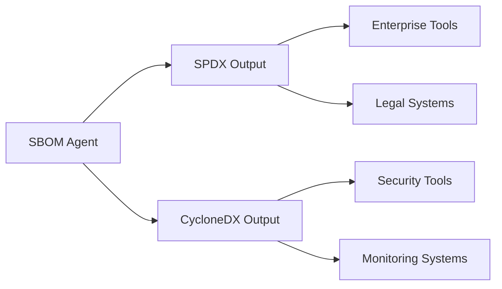
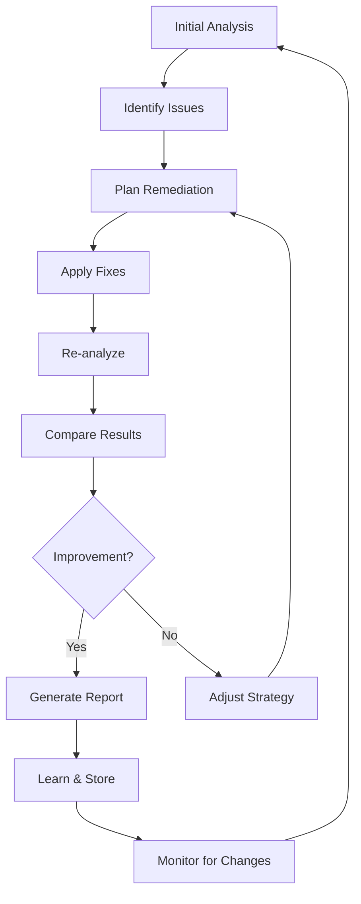

# 🏛️ Design Principles - SBOM Agent

## Open Standards Foundation

The SBOM Agent is architected around open standards to ensure maximum interoperability, transparency, and future-proofing.

### Core Standards

#### SPDX (Software Package Data Exchange)
- **Standard**: ISO/IEC 5962:2021, Linux Foundation specification
- **Version**: 2.3 (current), 3.0 (planned)
- **Purpose**: Legal compliance, license tracking, security correlation
- **Benefits**: 
  - Widely adopted by enterprise and government
  - Legal defensibility for open source usage
  - Integration with license management tools

#### CycloneDX  
- **Standard**: OWASP community standard
- **Version**: 1.5 (current), 1.6 (planned)
- **Purpose**: Application security and risk management
- **Benefits**:
  - Security-focused metadata
  - Vulnerability correlation
  - Continuous monitoring support

#### NTIA Minimum Elements
- **Authority**: US National Telecommunications and Information Administration
- **Purpose**: Government software transparency requirements
- **Elements**: Supplier name, component name, version, unique identifier, dependency relationships, SBOM author, timestamp
- **Compliance**: 7/7 elements with ongoing enhancement

### Why Open Standards Matter

#### Interoperability


#### Transparency
- **Auditable**: All methodology publicly documented
- **Reproducible**: Same inputs always produce same outputs
- **Verifiable**: Third-party validation possible

#### Future-Proofing
- **Standards Evolution**: Community-driven improvements
- **Vendor Independence**: No single vendor controls
- **Longevity**: Standards outlast individual products

## Agent-Based Architecture

### Tool-as-Agent Concept

The SBOM Agent operates as an autonomous agent capable of:

```python
class SBOMAgent:
    def analyze(self, project) -> AnalysisResult:
        """Perform comprehensive security analysis"""
        
    def plan_remediation(self, analysis) -> RemediationPlan:
        """Generate actionable fix recommendations"""
        
    def apply_fixes(self, plan) -> RemediationResult:
        """Automatically apply security patches"""
        
    def validate_improvements(self, before, after) -> ValidationResult:
        """Verify remediation effectiveness"""
        
    def learn_from_feedback(self, feedback) -> None:
        """Improve future recommendations"""
```

### Progressive Analysis Loop



### State Management

Every analysis run is tracked with:
- **Unique identifier** for correlation
- **Project state hash** for change detection
- **Complete SBOM snapshot** for comparison
- **Vulnerability inventory** with metadata
- **Remediation actions** applied
- **Effectiveness metrics** measured

## Environmental Isolation

### Zero-Pollution Principle

The SBOM Agent ensures complete isolation from target applications:

#### Container-First Design
```dockerfile
# Each analysis runs in isolation
FROM python:3.11-slim
WORKDIR /analysis
COPY requirements.txt .
RUN pip install -r requirements.txt
# Target project mounted read-only
VOLUME ["/workspace:ro", "/reports:rw"]
```

#### Virtual Environment Detection
```python
def ensure_isolation():
    """Prevent target application pollution"""
    if not in_virtual_environment():
        create_isolated_environment()
    validate_no_conflicts()
    track_installed_packages()
```

#### Fail-Safe Validation
- **Pre-flight checks**: Environment validation before analysis
- **Dependency conflicts**: Detection and resolution
- **Resource limits**: Memory and CPU constraints
- **Clean shutdown**: Complete cleanup after analysis

## Multi-Language Support Strategy

### Ecosystem Detection

```python
ECOSYSTEM_PATTERNS = {
    'python': ['requirements*.txt', 'setup.py', 'pyproject.toml'],
    'javascript': ['package.json', 'yarn.lock'],
    'java': ['pom.xml', 'build.gradle'],
    'go': ['go.mod', 'go.sum'],
    'rust': ['Cargo.toml', 'Cargo.lock'],
    'ruby': ['Gemfile', '*.gemspec'],
    'dotnet': ['*.csproj', 'packages.config'],
    'cpp': ['conanfile.txt', 'vcpkg.json']
}
```

### Package Manager Integration

Each ecosystem requires specific integration:

#### Python Ecosystem
```python
def analyze_python_packages():
    """Python package analysis strategy"""
    sources = [
        pip_list_analysis(),
        requirements_file_parsing(),
        setup_py_analysis(),
        poetry_lock_analysis()
    ]
    return merge_package_sources(sources)
```

#### JavaScript Ecosystem  
```python
def analyze_javascript_packages():
    """JavaScript package analysis strategy"""
    sources = [
        package_json_analysis(),
        npm_list_analysis(),
        yarn_lock_analysis(),
        pnpm_lock_analysis()
    ]
    return merge_package_sources(sources)
```

### Standards Mapping

Each package manager output is normalized to standard formats:

```python
def normalize_to_purl(ecosystem, name, version):
    """Convert to Package URL standard"""
    return f"pkg:{ecosystem}/{name}@{version}"

def map_to_spdx(package_info):
    """Map to SPDX package format"""
    return {
        "SPDXID": f"SPDXRef-Package-{package_info.name}",
        "name": package_info.name,
        "versionInfo": package_info.version,
        "downloadLocation": package_info.source_url,
        "filesAnalyzed": False,
        "licenseConcluded": package_info.license,
        "copyrightText": package_info.copyright
    }
```

## Vulnerability Scanning Strategy

### OSV Database Integration

```python
class OSVScanner:
    """Open Source Vulnerabilities database integration"""
    
    def __init__(self):
        self.api_base = "https://api.osv.dev/v1"
        self.cache = VulnerabilityCache()
        
    def scan_package(self, ecosystem, name, version):
        """Scan single package for vulnerabilities"""
        cached = self.cache.get(ecosystem, name, version)
        if cached and not cached.expired:
            return cached.vulnerabilities
            
        query = {
            "package": {"name": name, "ecosystem": ecosystem},
            "version": version
        }
        
        response = requests.post(f"{self.api_base}/query", json=query)
        vulnerabilities = self.parse_osv_response(response.json())
        
        self.cache.store(ecosystem, name, version, vulnerabilities)
        return vulnerabilities
```

### Severity Assessment

```python
def assess_vulnerability_severity(vulnerability):
    """Assess vulnerability severity using multiple scoring systems"""
    scores = []
    
    # CVSS v3 scoring
    if vulnerability.cvss_v3:
        scores.append(("cvss_v3", vulnerability.cvss_v3.base_score))
    
    # CVSS v2 scoring  
    if vulnerability.cvss_v2:
        scores.append(("cvss_v2", vulnerability.cvss_v2.base_score))
        
    # OSV scoring
    if vulnerability.osv_score:
        scores.append(("osv", vulnerability.osv_score))
    
    # Use highest score
    return max(scores, key=lambda x: x[1]) if scores else ("unknown", 0)
```

## Remediation Engine Design

### Fix Strategy Hierarchy

1. **Package Updates** (Safest)
   - Version bumps to patched releases
   - Constraint relaxation where safe
   - Alternative package suggestions

2. **Configuration Changes** (Medium Risk)
   - Security setting adjustments
   - Feature disabling
   - Access control tightening

3. **Code Modifications** (Highest Risk)
   - Pattern-based fixes
   - API usage updates
   - Security hardening

### Conflict Resolution

```python
class RemediationConflictResolver:
    """Resolve conflicts between remediation suggestions"""
    
    def resolve_version_conflicts(self, updates):
        """Resolve conflicting version requirements"""
        dependency_graph = self.build_dependency_graph(updates)
        constraints = self.extract_constraints(dependency_graph)
        
        # Use SAT solver for complex cases
        if self.is_complex_case(constraints):
            return self.sat_solve(constraints)
        else:
            return self.greedy_resolve(constraints)
    
    def validate_compatibility(self, proposed_changes):
        """Validate changes don't break functionality"""
        test_environment = self.create_test_environment()
        return test_environment.test_changes(proposed_changes)
```

## Reporting Philosophy

### Actionable Intelligence

Every report must provide:
- **Clear problem statement**: What is wrong?
- **Specific remediation**: How to fix it?
- **Risk assessment**: What happens if not fixed?
- **Validation criteria**: How to verify the fix?

### Progressive Storytelling

Reports tell the story of security improvement:

```python
class ProgressiveReport:
    def __init__(self, before_analysis, after_analysis):
        self.before = before_analysis
        self.after = after_analysis
        
    def generate_narrative(self):
        return {
            "executive_summary": self.executive_summary(),
            "detailed_improvements": self.detailed_improvements(),
            "remaining_risks": self.remaining_risks(),
            "next_steps": self.next_steps(),
            "success_metrics": self.success_metrics()
        }
```

### Multi-Format Output

- **HTML**: Interactive dashboards for stakeholders
- **JSON**: Machine-readable for tool integration
- **PDF**: Formal reports for compliance
- **SPDX/CycloneDX**: Standards-compliant SBOMs

## Quality Assurance Strategy

### Test-Driven Development

Every feature requires:
- **Unit tests** for individual functions
- **Integration tests** for component interaction
- **End-to-end tests** for complete workflows
- **Performance tests** for scalability validation

### Vulnerability Test Datasets

Curated collections of known vulnerabilities:
- **Python vulnerable projects** with documented CVEs
- **JavaScript vulnerable projects** with known exploits
- **Multi-language projects** with complex dependencies
- **Edge cases** that challenge detection logic

### Continuous Validation

```python
def continuous_validation_pipeline():
    """Ensure tool accuracy over time"""
    test_datasets = load_vulnerability_datasets()
    
    for dataset in test_datasets:
        results = sbom_agent.analyze(dataset.project_path)
        expected = dataset.expected_vulnerabilities
        
        assert_vulnerabilities_detected(results, expected)
        assert_no_false_positives(results, dataset.clean_packages)
        assert_remediation_effectiveness(results, dataset.fixes)
```

## Extensibility Framework

### Plugin Architecture

```python
class EcosystemPlugin:
    """Base class for ecosystem support plugins"""
    
    def detect_ecosystem(self, project_path):
        """Return True if ecosystem is present"""
        raise NotImplementedError
        
    def extract_packages(self, project_path):
        """Extract package information"""
        raise NotImplementedError
        
    def suggest_remediations(self, vulnerabilities):
        """Suggest ecosystem-specific fixes"""
        raise NotImplementedError
```

### Custom Scanners

```python
class VulnerabilityScanner:
    """Base class for vulnerability scanners"""
    
    def scan_package(self, package_info):
        """Scan package for vulnerabilities"""
        raise NotImplementedError
        
    def get_scanner_metadata(self):
        """Return scanner information"""
        raise NotImplementedError
```

This design ensures the SBOM Agent remains flexible, extensible, and aligned with open standards while providing maximum value to users across different environments and requirements.